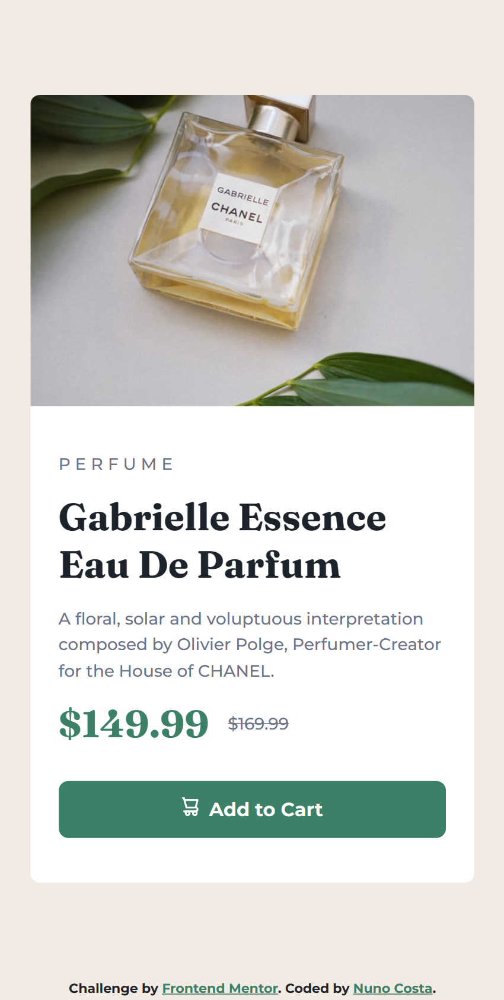
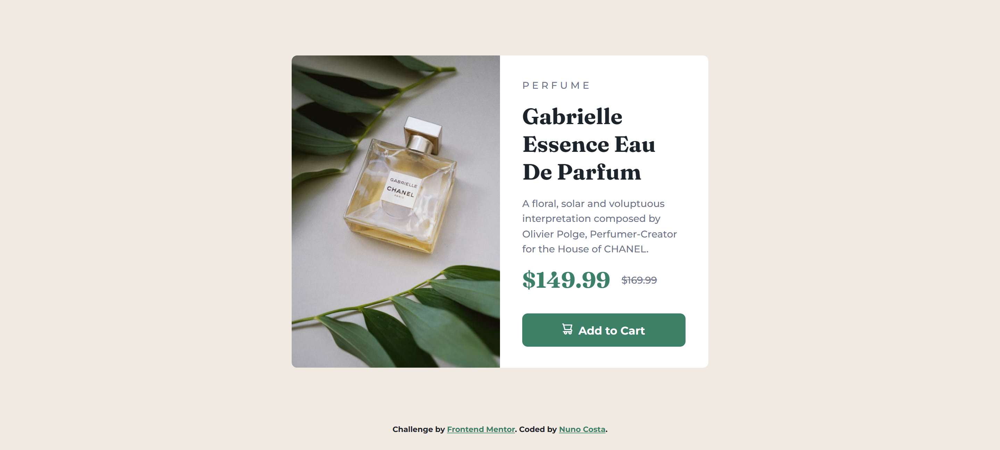

# Frontend Mentor - Product preview card component solution

This is a solution to the [Product preview card component challenge on Frontend Mentor](https://www.frontendmentor.io/challenges/product-preview-card-component-GO7UmttRfa). Frontend Mentor challenges help you improve your coding skills by building realistic projects.

## Table of contents

- [Overview](#overview)
  - [The challenge](#the-challenge)
  - [Screenshot](#screenshot)
  - [Links](#links)
- [My process](#my-process)
  - [Built with](#built-with)
  - [What I learned](#what-i-learned)
  - [Continued development](#continued-development)
  - [Useful resources](#useful-resources)
- [Author](#author)

## Overview

### The challenge

Users should be able to:

- View the optimal layout depending on their device's screen size
- See hover and focus states for interactive elements

### Screenshot

<h4 align="center"><strong>Mobile Design</strong></h4>

<p align="center">


<h4 align="center"><strong>Desktop Design</strong></h4>

<p align="center">


### Links

- Solution URL: [Solution URL](https://www.frontendmentor.io/solutions/product-preview-card-component-challenge-htmlcss-DID6osFR15)
- Live Site URL: [Live site URL](https://product-preview-card-component-challenge-gold.vercel.app/)

## My process

### Built with

- Semantic HTML5 markup
- CSS custom properties
- Flexbox
- Mobile-first workflow

### What I learned

Thanks to this project I learned a new CSS property, which is the text-decoration-line property.

```css
.product__info-price-normal {
  text-decoration-line: line-through;
}
```

### Continued development

My goal for the next days to come is to keep on building simpler projects such as this one to keep achieving a deeper understanding of CSS properties.

### Useful resources

- [W3Schools](https://www.w3schools.com/cssref/css3_pr_text-decoration-line.php) - W3Schools website helped me find the text-decoration-line property.

## Author

- Frontend Mentor - [@Bottom17](https://www.frontendmentor.io/profile/Bottom17)
